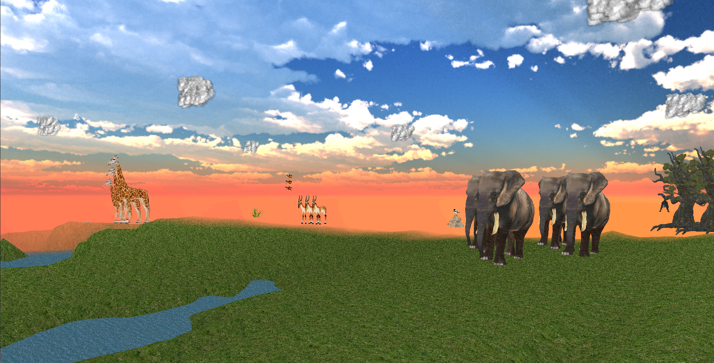

## The Psyche Journey 

**Description**

Interactive fiction game developed using Inform7.

You are at one of your soccer games, which has 5 minutes left on the clock, thus inducing high stress and nervousness from you. You are on the field waiting for the ball to be passed to you when all of a sudden you find yourself in a world unknown to you. When you wake up in this world you lack memory of what happened, who you are, and other memories. It is your mission to recover three lost memories in order to fully remember what occurred and get back to your life.

<a href="./assets/The Psyche Journey.zblorb" download>Download Game</a> (.zblorb)

<a href="./assets/playthrough.txt" download>Download Playthrough</a>

<a href="./assets/playthrough2.txt" download>Download Playthrough I</a>

## Pot It Like It's Hot! 

<video controls="true" allowfullscreen="true" width="500">
  <source src="./assets/PotItDemo.mp4" type="video/mp4" width="500">
</video>

**Description**

Developed with a team using Unity 2D and C#.

One evening by the fire, grandpa is telling you the story of farmers. Your purpose… your mission… as farmers is to save good plants and allow them to prosper in farms.

In a world where mutated plants are endangering lives everywhere, it is up to you, the brave farmer, to save the saplings that have not yet turned and bring them back to the farm to nurture. 

My contributions: Title Screen, Home Scene, Level 2, pause menu, Patrolling Plant enemy, playerController script, and player animations.

## Trembly, The Selfless Turtle 

    

**Description**

Developed with a partner using Greenfoot and Java.

Trembly is a timid and fearful turtle who hides in his shell when he encounters a scary situation or needs protection. Not only that, but Trembly is extremely selfless and helpful, so much, that he is willing to face his fears to help other animals in need. This makes him brave. 

In the first level, the selfless turtle, Trembly, meets a mama bird who lost her egg. She is in desperation because she cannot go find the egg herself since she needs to stay at the nest to guard it. Therefore, she kindly asks Trembly if he would go looking for and retrieve her egg for her. Trembly is hesitant because he doesn’t like exploring new and uncertain territories and is scared of heights and falling, but he realizes that if he doesn’t help mama bird, her egg will be lost forever... and so the journey begins!

Responsibilites: Finding the visuals for the game, including backgrounds, music, sound effects, and some NPC. Trembly’s collision detection with enemies and other harmful objects. Designing the layout of Level 3. Implemented Trembly’s health "bar".

[Download Project](https://drive.google.com/file/d/1HjEmGW_VUPCQwsGdnfhfNohku7xzF9mn/view?usp=sharing) 

## The Paint Mage 

<video controls="true" allowfullscreen="true" width="500">
  <source src="./assets/pagemageplay.mp4" type="video/mp4" width="500">
</video>

**Description**

Developed with a team using Unity 3D and C#.

In this top-down dungeon crawler game, you control a Paint Mage who finds themself at the bottom of a dungeon after a devastating betrayal. Your mission: draw tools with magical colored paint you find along the way, and journey to reach the top of the dungeon's tower. Defeat your back-stabbing apprentice and get back your rightful title!

[Download and Play](https://agreafel.itch.io/paint-mage)

## Pawsome Adventure

**Description**

Developed with Unity 3D and C#.

In this cute adventure game you play a dog who is ecstatic to collect bones! Run around the home collecting as many bones as you can before time runs out!

[Play Game](https://play.unity.com/mg/other/pawsome-adventure) 

[Download Project](https://drive.google.com/file/d/1TuPdTqW82jYdvK3a9fePkjPId6NxnBHY/view?usp=sharing) 

## A Journey into the Pride Lands of Africa

 

**Description**

Recreated The Lion King’s opening scene using OpenGL, C++, and Blender. 

Observe the animals of the Pride Lands of Africa gather around the Pride Rock to welcome their new prince of the land, Simba!

Incorporated the following graphics concepts: skybox, height mapping + procedural mapping, hierarchical limb movement, normal mapping, VAOs/VBOs, billboards, textures, diffuse and Specular lighting, and frame buffer.

Controls:

q - look up

e - look down

w - move forward

a - look left

s - move backwards

d - look right

<a href="./assets/lab terrain.sln" download>Download</a> (.sln)

[Download](https://drive.google.com/file/d/1Mds4g30hMjVAFWAGV635GqDiPlEo0h_b/view?usp=sharing) (.zip)
